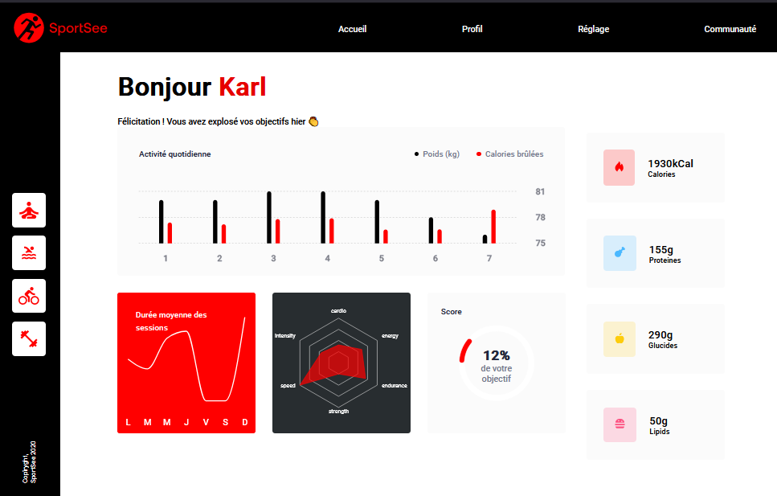

# SportSee

This is the user page, through which you can track your physical activity through graphs.

## Author
Tarik Maarij Abdallaoui

## Technologies

- Javascript / React
- React Router
- Recharts
- Fetch
- CSS
- HTML

## Installation

Clone the Back-End repository:

`git clone https://github.com/OpenClassrooms-Student-Center/P9-front-end-dashboard`

#### Install dependencies:

`npm install`

Launch back-end on port 3000 (default port):

`npm run start`

## Installing Front-end

Clone the Front-End repository:

`git clone https://github.com/TarikMaarijAbdallaoui/SportSee.git`

#### Install dependencies:

`npm install`

Lauch on port 3001:

`npm start`

Front-End is now rendered at URL http://localhost:3001